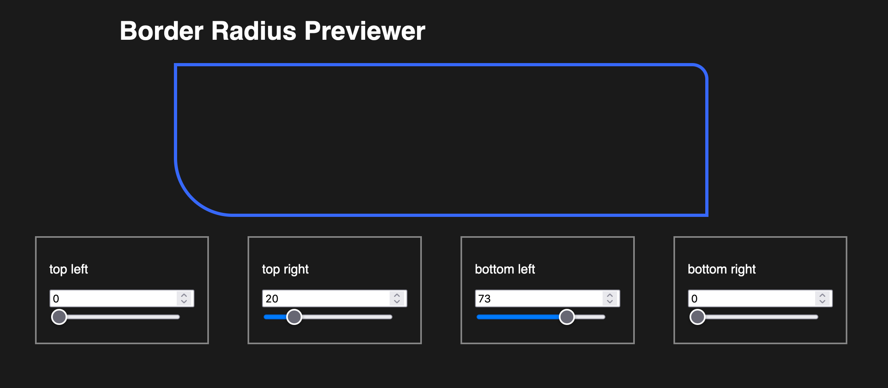

# border-radius-previewer

This is a just-fiddlin-around-repo to fiddle around with Ember.js and border radii.
It's a WIP, and probably always will be 🤷🏼‍♂️

That said, assuming I haven't used up my free tier allowance, you can find it deployed to Netlify [here.](https://634f4eb98c12e6220d3e1f87--spiffy-dieffenbachia-0939b9.netlify.app/)

A sneak peek:

Thanks for stopping by!

## TODOs:

- add component tests
- allow internal border and % radii
- tinker with better ways to hold/update state

  - light mode/theming options?

- services in ember
- better utilize MVC in ember
- QUnit tests

## Prerequisites

To run this code, you will need the following things installed on your computer.

- [Git](https://git-scm.com/)
- [Node.js](https://nodejs.org/) (with npm)
- [Ember CLI](https://cli.emberjs.com/release/)

## Installation

- `git clone <repository-url>` this repository
- `cd border-radius-previewer`
- `npm install`

## Running / Development

- `ember serve`
- Visit the app at [http://localhost:4200](http://localhost:4200).

### Running Tests

- `ember test`
- `ember test --server`

### Linting

- `npm run lint`
- `npm run lint:fix`

### Building

- `ember build` (development)
- `ember build --environment production` (production)

## Useful Links

- [ember.js](https://emberjs.com/)
- [ember-cli](https://cli.emberjs.com/release/)
- Development Browser Extensions
  - [ember inspector for chrome](https://chrome.google.com/webstore/detail/ember-inspector/bmdblncegkenkacieihfhpjfppoconhi)
  - [ember inspector for firefox](https://addons.mozilla.org/en-US/firefox/addon/ember-inspector/)
